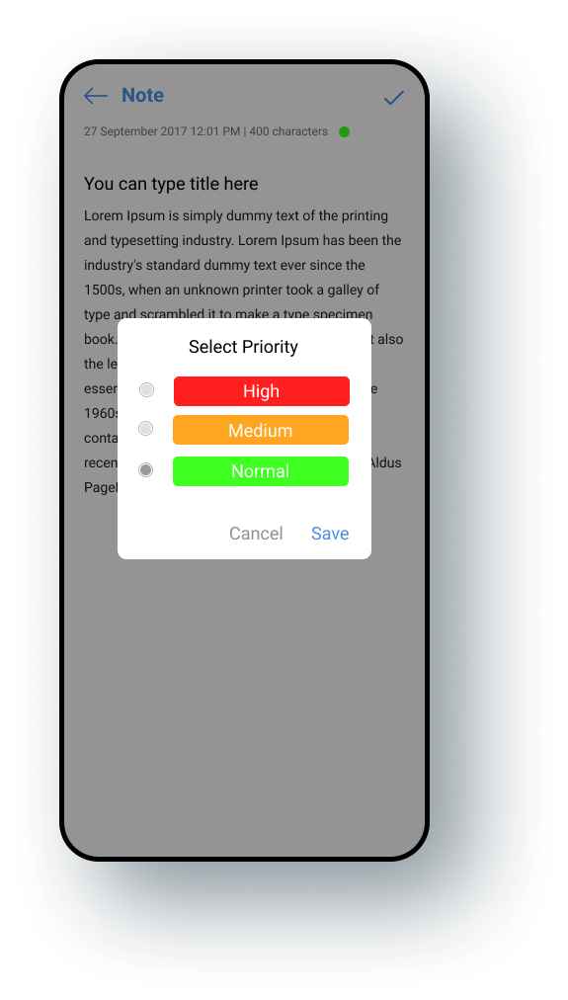

# Simple Note

[](https://www.android.com)
[](https://www.apache.org/licenses/LICENSE-2.0.html)
[](https://docs.gradle.org/current/release-notes)

📰 A Sample Note App written in Kotlin using Android Architecture Components, MVVM, etc.

# Instruction

## Gradle
```
plugins {
    id 'com.android.application'
    id 'kotlin-android'
    id 'kotlin-android-extensions'
    id 'androidx.navigation.safeargs.kotlin'
    id 'kotlin-kapt'
    id 'dagger.hilt.android.plugin'
}


buildscript {
    ext {
        //dependencies version
        kotlinVersion = "1.4.31"
        appCompatVersion = '1.2.0'
        coreVersion = '1.3.2'
        constraintLayoutVersion = '2.0.4'
        junitVersion = '4.13.1'
        junitExtversion = '1.1.2'
        espressoVersion = '3.3.0'
        androidTestVersion = '1.3.0'
        materialVersion = '1.2.1'
        recyclerViewVersion = '1.1.0'
        glideVersion = '4.11.0'
        navVersion = '2.3.5'
        ktxVersion = '1.1.0'
        gsonVersion = '2.9.0'
        chocobarVersion = 'V1.0'
        legacyVersion = '1.0.0'
        roomVersion = "2.3.0"
        lifecycleVersion = "2.3.1"
        archVersion = "2.1.0"
        coroutinesViersion = "1.5.0"
        cipherVersion = "4.4.3"
        hiltVersion = "2.35"
        daggerVersion = "2.37"
        rbPlusVersion = "1.0.1"
        rxKotlinVersion = "3.0.1"
        rxAndroidVersion = "3.0.0"
        rxBindingVersion = "2.2.0"
    }
    repositories {
        google()
        jcenter()
    }
    dependencies {
        classpath "com.android.tools.build:gradle:4.1.3"
        classpath "org.jetbrains.kotlin:kotlin-gradle-plugin:$kotlinVersion"
        classpath "androidx.navigation:navigation-safe-args-gradle-plugin:$navVersion"
        classpath "com.google.dagger:hilt-android-gradle-plugin:$hiltVersion"
    }
}


dependencies {
    //kotlin
        implementation "org.jetbrains.kotlin:kotlin-stdlib:$kotlinVersion"
        implementation "androidx.core:core-ktx:$coreVersion"
    
        //ui
        implementation "androidx.appcompat:appcompat:$appCompatVersion"
        implementation "androidx.constraintlayout:constraintlayout:$constraintLayoutVersion"
        implementation "androidx.recyclerview:recyclerview:$recyclerViewVersion"
        implementation "com.google.android.material:material:$materialVersion"
        implementation "com.github.bumptech.glide:glide:$glideVersion"
        implementation "androidx.legacy:legacy-support-v4:$legacyVersion"
    
        // ViewModel
        implementation "androidx.lifecycle:lifecycle-viewmodel-ktx:$lifecycleVersion"
    
        // LiveData
        implementation "androidx.lifecycle:lifecycle-livedata-ktx:$lifecycleVersion"
    
        //hilt
        implementation("com.google.dagger:hilt-android:$hiltVersion")
        kapt("com.google.dagger:hilt-android-compiler:$hiltVersion")
    
        //dagger
        implementation "com.google.dagger:dagger:$daggerVersion"
        kapt "com.google.dagger:dagger-compiler:$daggerVersion"
    
        // Annotation processor
        kapt "androidx.lifecycle:lifecycle-compiler:$lifecycleVersion"
    
        //kotlin coroutines
        implementation "org.jetbrains.kotlinx:kotlinx-coroutines-core:$coroutinesViersion"
        implementation "org.jetbrains.kotlinx:kotlinx-coroutines-android:$coroutinesViersion"
    
        //rxKotlin
        implementation "io.reactivex.rxjava3:rxkotlin:$rxKotlinVersion"
        implementation "io.reactivex.rxjava3:rxandroid:$rxAndroidVersion"
    
        //rxBinding
        implementation "com.jakewharton.rxbinding2:rxbinding:$rxBindingVersion"
        implementation "com.jakewharton.rxbinding2:rxbinding-design:$rxBindingVersion"
    
        // Room
        implementation "androidx.room:room-runtime:$roomVersion"
        kapt "androidx.room:room-compiler:$roomVersion"
    
        // Kotlin Extensions and Coroutines support for Room
        implementation "androidx.room:room-ktx:$roomVersion"
    
        // SQLCipher
        implementation "net.zetetic:android-database-sqlcipher:$cipherVersion"
    
        // Navigation component Kotlin
        implementation "androidx.navigation:navigation-fragment-ktx:$navVersion"
        implementation "androidx.navigation:navigation-ui-ktx:$navVersion"
    
        //Radio button plus
        implementation ("com.github.worker8:RadioGroupPlus:$rbPlusVersion"){
            transitive = false
        }
    
        //Chocobar
        implementation "com.github.Pradyuman7:ChocoBar:$chocobarVersion"
    
        //testing
        testImplementation "junit:junit:$junitVersion"
        androidTestImplementation "junit:junit:$junitVersion"
        androidTestImplementation "androidx.test.espresso:espresso-core:$espressoVersion"
        androidTestImplementation "androidx.test.espresso:espresso-contrib:$espressoVersion"
        androidTestImplementation "androidx.test:runner:$androidTestVersion"
        androidTestImplementation "androidx.test:rules:$androidTestVersion"
        androidTestImplementation "androidx.test.ext:junit:$junitExtversion"
}
```

## Notes

### Features
---
- Splash screen.
- Notes search.
- Make note.
- Note priority.

### Application Architecture
---
- IDE: Android Studio
- Arthitecture: MVVM
- Programming Language: Kotlin
- Third Party Libraries: Hilt, Dagger, Navigation Component, RxJava, Room, SQLCipher Glide, ButterKnife, Gson, etc...

# Demo App

<table style="width:100%">
  <tr>
    <th>Example 1</th>
    <th>Example 2</th>
  </tr>
  <tr>
    <td></td>
    <td></td>
  </tr>
  <tr>
    <th>Example 3</th>
    <th>Example 4</th>
  </tr>
  <tr>
    <td></td>
    <td></td>
  </tr>
  <tr>
      <th>Example 5</th>
      <th>Example 6</th>
    </tr>
    <tr>
      <td></td>
      <td></td>
    </tr>
</table>

# License

```
    Copyright (C) Achmad Qomarudin

    Licensed under the Apache License, Version 2.0 (the "License");
    you may not use this file except in compliance with the License.
    You may obtain a copy of the License at

       http://www.apache.org/licenses/LICENSE-2.0

    Unless required by applicable law or agreed to in writing, software
    distributed under the License is distributed on an "AS IS" BASIS,
    WITHOUT WARRANTIES OR CONDITIONS OF ANY KIND, either express or implied.
    See the License for the specific language governing permissions and
    limitations under the License.
```
